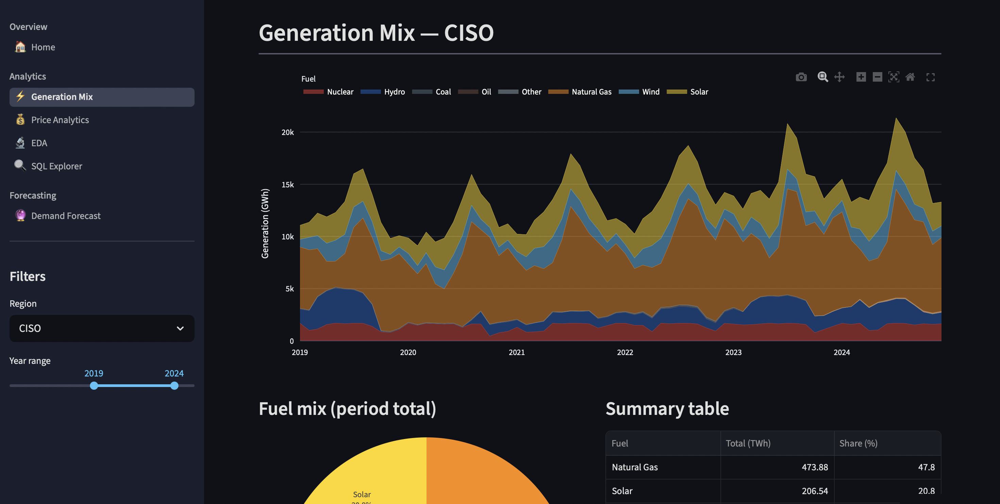
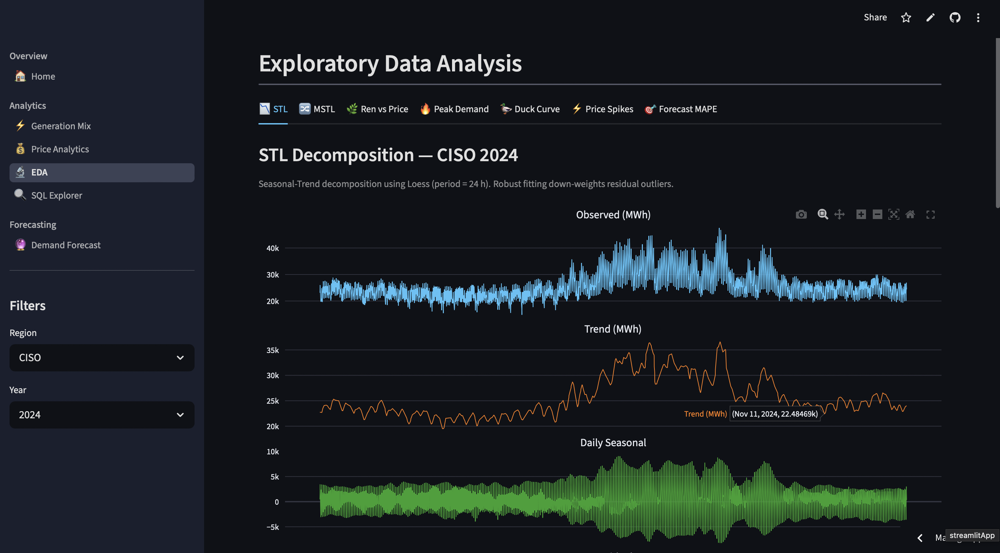
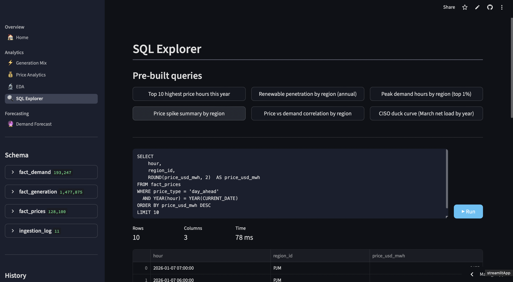
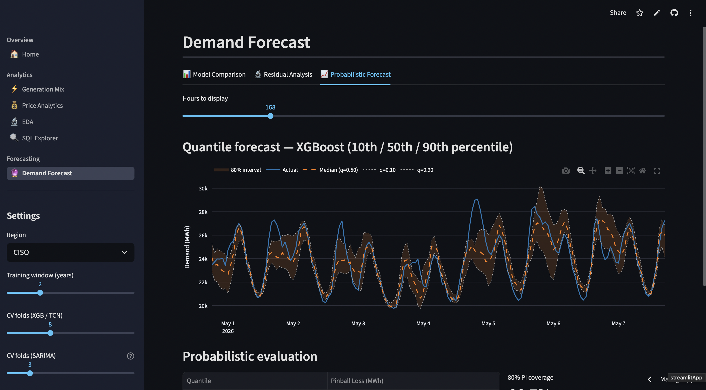
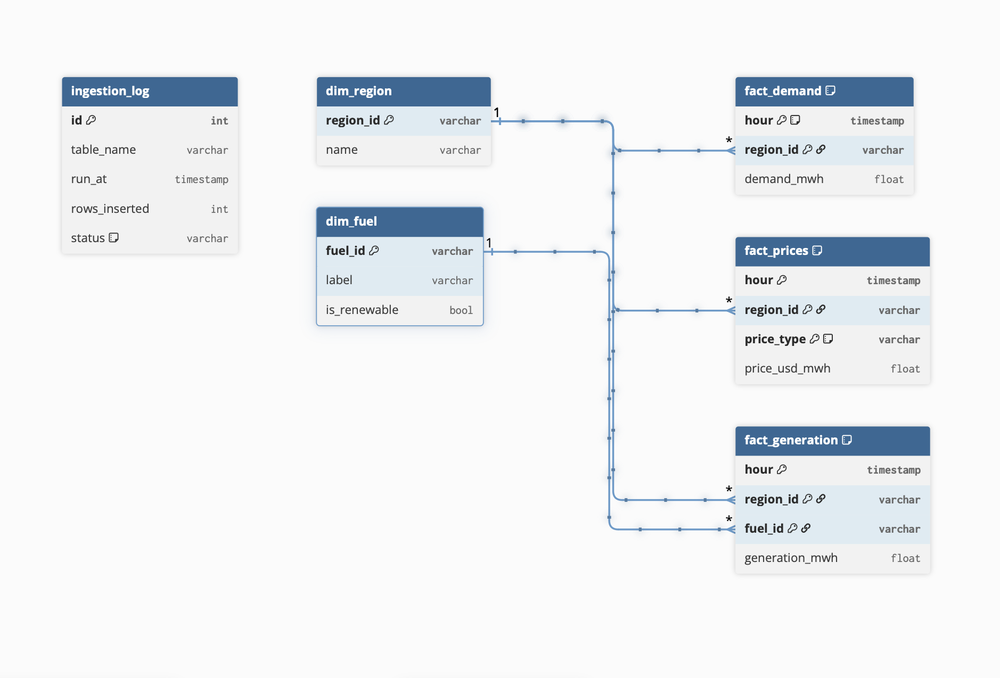

# US Electricity Market Analytics Platform

An interactive analytics dashboard for US wholesale electricity markets, covering six balancing authorities (CAISO, PJM, ERCOT, MISO, NYISO, ISO-NE) from 2014 to present. Built on live EIA API data, DuckDB, and Streamlit. Includes OLS panel regression, expanding-window demand forecasting with Diebold-Mariano significance testing, and residual diagnostics.

**Live app →** [electricity-market-analytics.streamlit.app](https://electricity-market-analytics.streamlit.app)  
**Paper →** [Full Write-Up (Overleaf)](https://www.overleaf.com/read/bthwwwmvqcvc)

---

## Key Findings

**1. No detectable merit order effect in CAISO.** OLS regression of weekly average day-ahead price on renewable share yields a statistically insignificant coefficient (0.157 $/MWh per percentage point, p = 0.8). Seasonal regressions show sign-switching slopes with R² < 0.03, suggesting curtailment may suppress the reported relationship.

**2. Duck curve deepening.** CAISO's net load trough has dropped ~4.5% since 2022 as solar capacity grew. The evening ramp (16:00–21:00) increased from ~3,400 MWh to ~7,700 MWh between 2022 and 2024.

| Year | Net load 13:00 (MWh) | Net load 20:00 (MWh) | Evening ramp (MWh) |
|---|---|---|---|
| 2022 | 20,223 | 12,241 | 3,432 |
| 2023 | 20,064 | 11,439 | 5,022 |
| 2024 | 19,363 | 10,875 | 7,729 |

**3. TCN outperforms SARIMA on 24-hour demand forecasting (p < 0.001).** Expanding-window CV (60-day initial window, 7-day step) on CAISO summer 2024:

| Model | MAE (MWh) | RMSE (MWh) | MAPE |
|---|---|---|---|
| TCN | 694 | 1,099 | 2.4% |
| SARIMA | 1,133 | 1,326 | 3.9% |
| XGBoost | 1,295 | 1,623 | 4.4% |

Diebold-Mariano tests (HLN size-corrected, Newey-West HAC variance): TCN vs. SARIMA DM = −6.96, p < 0.001; XGBoost vs. SARIMA DM = −6.48, p < 0.001; XGBoost vs. TCN DM = +1.56, p = 0.12 (no significant difference).

**4. Price spike clustering.** Spikes (>3σ above 168-hour rolling mean) in CAISO concentrate in winter evenings (50%) and transition shoulder hours (50%), with zero spikes in summer — contrary to typical grid patterns. Spike duration ranges from 1 to 4 hours.

---

## Dashboard Pages

| Page | What it shows |
|---|---|
| Home | Live data timestamp, region coverage, record counts |
| Generation Mix | Stacked area of fuel contributions over time by region |
| Price Analytics | Hour × day-of-week heatmap, spike table, merit order scatter |
| EDA | STL/MSTL decomposition, duck curve profiling, peak profiling, spike characterization |
| SQL Explorer | Live DuckDB query editor with schema browser and pre-built queries |
| Demand Forecast | SARIMA / XGBoost / TCN benchmark, residual diagnostics, quantile regression |








---

## Data Model



Three fact tables (demand, prices, generation) share a composite key on `(hour, region_id)`. Dimension tables for regions and fuel types. An ingestion log tracks data freshness per table.

---

## Run Locally

**Prerequisites:** Python 3.11+, an [EIA API key](https://www.eia.gov/opendata/register.php)

```bash
git clone https://github.com/keltonmccormick18/Electricity-Market-Analytics.git
cd Electricity-Market-Analytics
python -m venv .venv && source .venv/bin/activate
pip install -r requirements.txt
```

Create `.streamlit/secrets.toml`:

```toml
EIA_API_KEY = "your_key_here"
# Optional — omit to use a local DuckDB file instead
# MOTHERDUCK_TOKEN = "your_token_here"
```

Ingest data (writes to `energy.duckdb` locally):

```bash
python ingestion.py --regions CISO PJM ERCO --start 2020-01-01
```

Run the dashboard:

```bash
streamlit run app.py
# Navigate to http://localhost:8501
```

---

## Tech Stack

| Layer | Tool |
|---|---|
| Data store | DuckDB (local) / MotherDuck (cloud) |
| Ingestion | Python + EIA API v2, pandas bulk inserts |
| Dashboard | Streamlit ≥ 1.36, Plotly |
| Forecasting | statsmodels (SARIMA), XGBoost, Ridge + dilated Gaussian convolutions (TCN) |
| Statistical testing | Diebold-Mariano (HLN), Ljung-Box, ARCH-LM |
| Deployment | Streamlit Community Cloud |

---

## Repository Structure

```
├── app.py               # st.navigation router
├── db.py                # DuckDB connection layer (local + MotherDuck)
├── ingestion.py         # EIA API ingestion with retry + bulk inserts
├── schema.sql           # CREATE TABLE IF NOT EXISTS for all four tables
├── constants.py         # Fuel colours, region lists, label maps
├── forecasting.py       # SARIMA / XGBoost / TCN CV + evaluation backend
├── eda.py               # EDA computation backend
└── views/
    ├── home.py
    ├── generation_mix.py
    ├── price_analytics.py
    ├── eda.py
    ├── sql_explorer.py
    └── forecast.py
```

---

## Limitations

- Forecasting results reflect a single region (CAISO) and season (summer 2024) with a short data window. Broader validation is needed before generalizing.
- No real weather data — temperature is approximated with a sinusoidal proxy capturing the average annual cycle only.
- Renewable share coefficients are descriptive, not causal. Proper causal estimation would require instrumental variables (wind speed, solar irradiance) not currently in the dataset.
